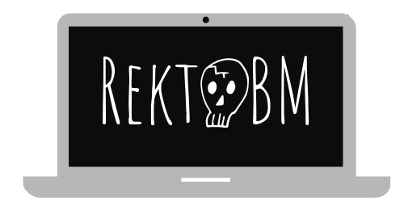

<p align="center">
  
</p>

<p align="center">
  <a href="https://github.com/RektPunk/RektGBM/releases/latest">
    
  </a>
  <a href="https://github.com/RektPunk/RektGBM/blob/main/LICENSE">
    
  </a>
  <a href="https://pypi.org/project/rektgbm">
    
  </a>
  <a href="https://github.com/RektPunk/RektGBM/actions/workflows/lint.yaml">
    
  </a>
</p>

Are you sick and tired of the endless cycle of model comparisons and hyperparameter tuning? Meet **RektGBM**, your ultimate no-brainer solution to building good enough performance machine learning models. **RektGBM** seamlessly combines [LightGBM](https://github.com/microsoft/LightGBM) and [XGBoost](https://github.com/dmlc/xgboost), two leading gradient boosting frameworks available today.

**RektGBM** simplifies the complexities of model building and optimization, delivering a robust, yet easy-to-use platform that empowers you to achieve superior results without the hassle. With the integration of [Optuna](https://github.com/optuna/optuna), a cutting-edge hyperparameter optimization framework, **RektGBM** fine-tunes your models to perfection, ensuring optimal performance with minimal effort.


# Installation
Getting started with RektGBM is a breeze. Install it using pip:
```bash
pip install rektgbm
```

# Key Features
- **RektDataset**: A wrapper for datasets used in `RektGBM` and `RektOptimizer`.
- **RektGBM**: A versatile gradient boosting model that leverages the power of both LightGBM and XGBoost.
- **RektOptimizer**: An Optuna-based optimizer that fine-tunes RektGBM hyperparameters for maximum efficiency.

# Usage
## Example workflow
Here’s a quick example to showcase how you can use RektGBM in your machine learning pipeline:
```bash
$ rektgbm --help
Usage: rektgbm [OPTIONS] DATA_PATH TEST_DATA_PATH TARGET [RESULT_PATH] [N_TRIALS]
╭─ Arguments ───────────────────────────────────────────────────────────────────────────────────╮
│ *    data_path        TEXT           Path to the training data file.  [required]
│ *    test_data_path   TEXT           Path to the test data file.  [required]
│ *    target           TEXT           Name of the target column.  [required]
│      result_path      [RESULT_PATH]  Path to the prediction results. [default: predict.csv]
│      n_trials         [N_TRIALS]     Number of optimization trials. [default: 100]
╰───────────────────────────────────────────────────────────────────────────────────────────────╯
╭─ Options ─────────────────────────────────────────────────────────────────────────────────────╮
│ --help          Show this message and exit.
╰───────────────────────────────────────────────────────────────────────────────────────────────╯

$ rektgbm train.csv test.csv target predict.csv 100
```

Alternatively, the same functionality is available through Python.
```python
import pandas as pd
from rektgbm import RektDataset, RektGBM, RektOptimizer

# Prepare your datasets
X_train = pd.read_csv("train.csv")
X_test = pd.read_csv("test.csv")
y_train = X_train.pop("target")

dtrain = RektDataset(data=X_train, label=y_train)
dtest = RektDataset(data=X_test)

# Initialize RektOptimizer to automatically detect task type, objective, and metric
rekt_optimizer = RektOptimizer()

# Optimize hyperparameters over 100 trials
rekt_optimizer.optimize_params(dataset=dtrain, n_trials=100)

# Initialize RektGBM with the optimized hyperparameters
rekt_gbm = RektGBM(**rekt_optimizer.best_params)

# Train the model
rekt_gbm.fit(dataset=dtrain)

# Make predictions on the test set
preds = rekt_gbm.predict(dataset=dtest)
pd.DataFrame(preds).to_csv("predict.csv")

# DONE!
```

# More Examples
For more detailed examples, check out the [Examples](https://github.com/RektPunk/RektGBM/tree/main/examples) section.

# Contribution
Welcome all contributions! Please note that this project might have some bugs, so your contributions in identifying and fixing them are especially valuable! Whether you want to create an issue or submit a pull request, your input is appreciated. Feel free to get involved in any way that suits you.
